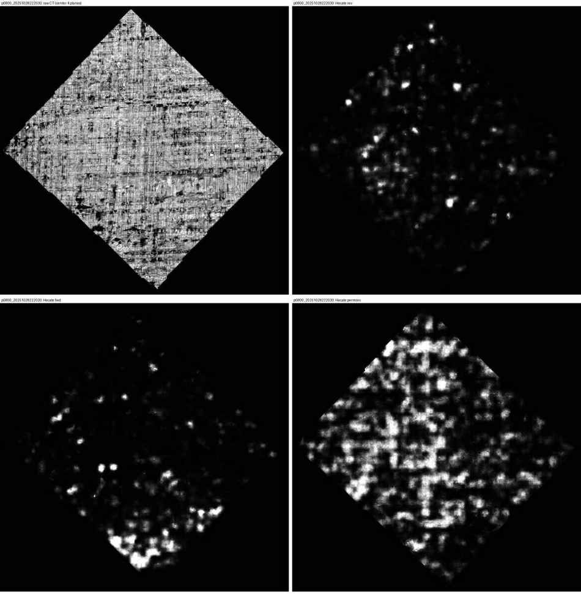
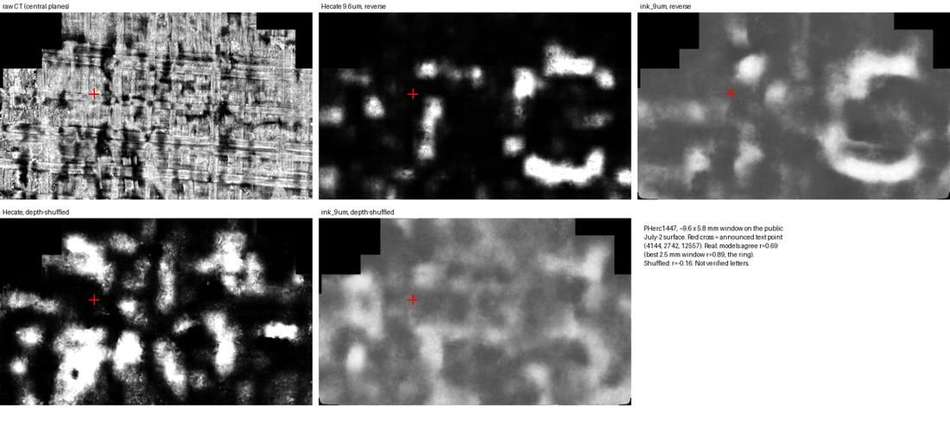
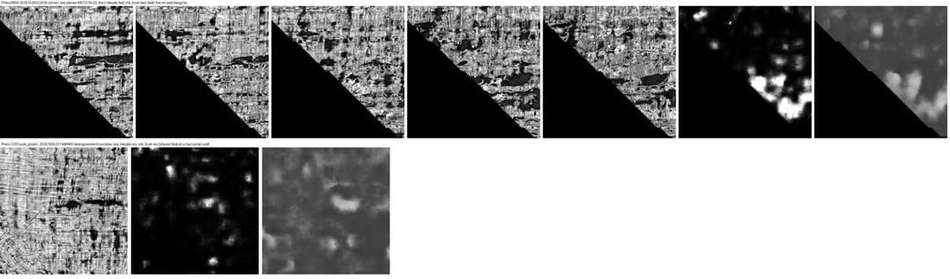

# Depth-order and cross-model controls for 9 µm ink detection

**An audit of every public surface on the First Letters scrolls, using the two public 9 µm ink models**

*Progress Prize submission, September 2026. Code MIT. Data: Vesuvius Challenge open data (CC BY-NC 4.0).*

---

## TL;DR

The 2026 Open Problems note that *"better diagnostics matter just as much as better models."* This repo adds two cheap diagnostics that any 9 µm ink-detection result can be checked against. It also reports what they show on all ~52 cm² of public surfaces on the eligible First Letters scrolls (PHerc0800, PHerc1203).

1. **Depth-order control.** Randomly permute the central 16 CT planes of a surface render and re-run the model. Real ink should depend on the physical plane order through the sheet.
   - **Finding:** the released **Hecate 9.6 µm** model produces **more** positive pixels (p > 0.5) on depth-shuffled input than on real input. This held on **10 / 10** public eligible segments. It also held at the location where text was announced on PHerc1447 (0.176 shuffled vs 0.075 real).
   - **Consequence:** the amount of "ink" a 9 µm model paints is not evidence. Only its *shape* can be.

2. **Cross-model agreement.** Run the two independently released 9 µm models (`scrollprize/ink_9um` and `scrollprize/hecate`) on the *same* render and correlate their probability maps. Do the same on the shuffled render.
   - **At the PHerc1447 text location**, the two models agree strongly: global r = 0.69, and the best 2.5 mm window reaches r = 0.89 on a letter-sized ring. On the shuffled input, agreement collapses to r = −0.16.
   - **On the eligible PHerc0800 / PHerc1203 surfaces**, global agreement ranges from −0.06 to 0.40 (median 0.12). The windows with the highest local agreement fall on **void margins and render boundaries**, not strokes (examples below).

3. **Reusable renderer.** `render_surface.py` produces isotropic 9.6 µm surface renders from any public tifxyz mesh plus volume zarr (or from an official surface-volume zarr). It downloads only the chunks the surface touches.

**Bottom line for the community.** With the public 9 µm models and the public meshes, we found **no letter candidates** on the eligible scrolls. When either model lights up on these surfaces, the controls here show it is usually depth-order-independent or void-driven. We think the pair of controls is a cheap first filter for anyone screening new surfaces or new models.

---

## What is in this repo

| File | Purpose |
|---|---|
| `render_surface.py` | tifxyz mesh + CT zarr → `(24, H, W)` uint8 render at 9.6 µm in all axes, planes along the mesh normal. Also resamples official surface-volume zarrs. Minimal zarr-v2 reader with an on-disk chunk cache; any numcodecs compressor. |
| `depth_order_control.py` | Runs a model forward, reverse and depth-shuffled (fixed seed). Writes probability PNGs, a JSON of positive fractions and densest windows, and a 4-panel figure. Uses Hecate by default; any model can be plugged in with `--cmd`. |
| `ink9um_infer.py` | Runs the pinned official `ink_9um` hybrid_3d2d seed42 step-75000 checkpoint on the same renders: 17 central planes, 128² tiles, Hann blending. Uses the Villa implementation. |
| `cross_model_agreement.py` | Global and local (2.5 mm window) Pearson agreement between two models' maps, real vs shuffled, excluding a margin at the render boundary. |
| `results/` | Per-surface tables (`control_summary.csv`, `cross_model_agreement.csv`, `shape_metrics.json`) (the PHerc1447 reference render window is available on request; it is 10 MB). |
| `*.jpg` | Figures used below. |

## Quick start

```bash
pip install numpy scipy tifffile pillow numcodecs torch     # + Hecate's requirements
# 1. render (only touched chunks are downloaded)
B=https://vesuvius-challenge-open-data.s3.amazonaws.com
python render_surface.py tifxyz \
  --tifxyz $B/PHerc1203/segments/raw/auto_grown_20251005231446965 \
  --volume $B/PHerc1203/volumes/20250820131727-9.362um-1.2m-113keV-masked.zarr/0 \
  --voxel-um 9.362 --out p1203_B.npy
python render_surface.py surface-volume \
  --zarr $B/PHerc0800/segments/20251028222030-auto_grown_20251028222030940/surface-volumes/8.64um-1.2m-116keV-volume-20250521135224.zarr/0 \
  --voxel-um 8.64 --out p0800_222030.npy
# 2. depth-order control with Hecate (hecate.py + hecate_9.6um.pth from HF scrollprize/hecate)
python depth_order_control.py p1203_B.npy --hecate hecate.py --checkpoint hecate_9.6um.pth --device cuda
# 3. second model + agreement (ink_9um needs the Villa `vesuvius` package on PYTHONPATH)
python ink9um_infer.py p1203_B.npy p1203_B-ink9-rev.png --checkpoint step-075000.pth --reverse
python cross_model_agreement.py --valid p1203_B-valid.npy \
  --real control-out/p1203_B-reverse.png p1203_B-ink9-rev.png \
  --shuffled control-out/p1203_B-shuffled.png p1203_B-ink9-shuf.png --out agree.json
```

A single RTX 4090/A6000 renders an 11 cm² segment and runs both models on it (both orders plus the shuffle control) in about 15 minutes. The complete audit below cost about **$1.30** of RunPod time, including two pods that came up without a working GPU.

## Method details

- **Sampling.**
  - Hecate's card requires renders at 9.6 µm in plane *and* depth, so everything is resampled to 9.6 µm. That means 24 planes, ±110 µm, trilinear interpolation.
  - For tifxyz meshes, the stored grid (scale 0.05) is bilinearly upsampled, and normals come from central differences (u × v).
  - PHerc0800 uses the organizers' 31-plane 8.64 µm surface volumes.
  - The renderer was checked byte-for-byte against an independent implementation on a PHerc1203 crop and on one PHerc0800 surface volume.
- **Both depth orders** are always run. The correct normal sign is unknown per mesh, and a successful control can be strongly direction-sensitive.
- **Shuffle control.**
  - The central 16 planes are permuted with seed 20260927, then the model is run in the reverse orientation.
  - Each pixel keeps exactly the same intensities through depth; only their order changes.
  - For ink_9um, whose 17-plane window includes those 16, the same shuffled volume is used.
- **Agreement.**
  - Pearson r between the two models' probability maps over valid pixels. Pixels within 64 px (0.6 mm) of the render boundary are excluded, because both models misbehave where their field of view runs off the surface.
  - Local r is computed in 256 px (2.46 mm) windows, step 64, keeping only windows where both maps have ≥2% pixels above 0.5.
- **Integrity.**
  - Checkpoint SHA-256: ink_9um `e635558a…9cab` (HF revision `7109667e`); Hecate 9.6 µm `809f4f10…fe5d`.
  - GPU output matched CPU output to ≤1/255 for both models.

## Results

### 1. Depth-order control (Hecate 9.6 µm): fraction of valid pixels with p > 0.5

| Surface | cm² | reverse | forward | **shuffled** |
|---|---:|---:|---:|---:|
| PHerc0800 20251028213516 (official SV) | 1.70 | 0.092 | 0.012 | **0.143** |
| PHerc0800 20251028220042 (official SV) | 1.58 | 0.023 | 0.041 | **0.108** |
| PHerc0800 20251028220955 (official SV) | 1.53 | 0.121 | 0.035 | **0.197** |
| PHerc0800 20251028222030 (official SV) | 2.34 | 0.007 | 0.025 | **0.110** |
| PHerc0800 20251028225813 (official SV) | 1.83 | 0.011 | 0.012 | **0.171** |
| PHerc0800 20251029010146 (official SV) | 0.36 | 0.015 | 0.002 | **0.242** |
| PHerc1203 auto_grown_20251005231446965 | 10.99 | 0.010 | 0.008 | **0.056** |
| PHerc1203 auto_grown_20251005221856743 | 10.26 | 0.072 | 0.056 | **0.115** |
| PHerc1203 auto_grown_20250930104534929 | 7.65 | 0.031 | 0.037 | **0.098** |
| PHerc1203 auto_grown_20251005230830031 (folded mesh) | 14.19 | 0.017 | 0.013 | **0.039** |
| *Reference: PHerc1447 announced-text window* | 0.51 | 0.075 | 0.068 | **0.176** |

On all ten segments the shuffled input gives the highest positive fraction, and it also does at the PHerc1447 text location. Positive area therefore cannot distinguish ink from depth-order-independent responses. On PHerc1447, what survives the control is **shape**: the reversed-order map has a coherent ~3 mm ring, and the shuffled map is uncorrelated with it (r = −0.04).



We also ran four earlier non-public renders (small surfaces we grew ourselves on PHerc0813, 0125 and 0800). The pattern held on the two PHerc0800 ones. On PHerc0125 it was a near-tie (0.097 shuffled vs 0.101 forward). On PHerc0813 r18 it reversed: the shuffled input gave *fewer* positives (0.010 vs 0.066/0.108). That table is in `results/control_summary.csv`, but those meshes are not published here.

### 2. Cross-model agreement (ink_9um vs Hecate, same render)

| Surface | global r reverse | global r forward | global r **shuffled** | best 2.5 mm window r (rev / fwd / shuffled) |
|---|---:|---:|---:|---|
| *PHerc1447 announced-text reference window (not eligible)* | +0.69 | +0.37 | -0.16 | +0.89 / +0.67 / +0.31 |
| PHerc0800 20251028213516 (official SV) | +0.12 | +0.16 | +0.03 | +0.48 / +0.33 / +0.49 |
| PHerc0800 20251028220042 (official SV) | +0.16 | +0.23 | -0.01 | +0.66 / +0.75 / +0.43 |
| PHerc0800 20251028220955 (official SV) | +0.19 | +0.21 | +0.05 | +0.48 / +0.53 / +0.57 |
| PHerc0800 20251028222030 (official SV) | +0.04 | +0.40 | -0.07 | +0.59 / +0.79 / +0.39 |
| PHerc0800 20251028225813 (official SV) | +0.05 | +0.12 | +0.06 | +0.23 / +0.43 / +0.47 |
| PHerc0800 20251029010146 (official SV) | -0.06 | -0.06 | +0.03 | – / – / +0.28 |
| PHerc1203 auto_grown_20251005231446965 | +0.04 | +0.04 | -0.14 | +0.72 / +0.41 / +0.48 |
| PHerc1203 auto_grown_20251005221856743 | +0.19 | +0.22 | -0.18 | +0.79 / +0.74 / +0.53 |
| PHerc1203 auto_grown_20250930104534929 | +0.09 | +0.16 | -0.05 | +0.72 / +0.67 / +0.46 |
| PHerc1203 auto_grown_20251005230830031 (folded mesh) | +0.04 | +0.02 | -0.08 | +0.68 / +0.66 / +0.52 |

Reading the table:

- **PHerc1447.** Both models agree much more than on any eligible surface: global r = 0.69 in the reversed order, against −0.06 to 0.23 for all eligible surface/direction pairs except one, which reaches 0.40. Shuffling the depth order removes the agreement (−0.16).
- **Eligible surfaces.** Real-input agreement exceeds shuffled-input agreement on most of them, so the two models do share *something* depth-dependent. Inspection shows it is structure such as voids and layer boundaries, not strokes (next section).
- **Local maxima.** On the large PHerc1203 meshes (hundreds of windows), individual windows reach r 0.66–0.79. Given how many windows are tested, these maxima are expected, and every one we inspected is an artifact. The PHerc1447 ring reaches 0.89 from only 49 windows.
- **The eligible surface closest to the PHerc1447 level** is PHerc0800 `…222030`, forward (0.40). Its agreement comes from a corner full of large voids (figure below).



### 3. What the highest-agreement windows on eligible scrolls actually are

- **Render boundaries.** Before the margin rule, the single highest-agreement region on PHerc0800 `…222030` was the corner of the surface volume. Both models fire along the edge of their field of view.
- **Void margins.** After excluding the boundary, the top windows on PHerc0800 `…222030` and PHerc1203 `…231446965` sit on large air pockets and gaps visible in the raw planes. Both models respond to the same void edge as a 1–2 mm blob with no stroke structure (`void_margin_examples.jpg`).
- **Folded or torn mesh.** On PHerc1203 `…221856743`, the best-agreement window and the densest Hecate responses sit where the mesh is torn and crosses layers. The render shows seams there.



So agreement between two models is a useful signal only after boundaries and voids are excluded. Even then it should be read together with the shuffle control and the raw CT.

## Limitations (please read)

- **One positive reference.** The PHerc1447 comparison uses a single known-positive area. The announced letters were found with a *fine-tuned* model that has not been released. We could not register the announcement image onto our render, so we know our surface passes within ~9 µm of the announced point (4144, 2742, 12557), but not exactly where each letter sits.
- **The models are not fully independent.** Hecate was distilled from the canonical 2 µm detector; ink_9um was trained on PHerc0139/1667/Paris4/0814. Shared training data or shared biases (voids, fibres) can create agreement that is not ink.
- **Resampling.** All maps are on 9.6 µm renders, and the scans are 8.64 µm or 9.362 µm. Hecate requires this; for ink_9um it is a small deviation from its native grid. On PHerc1447, Hecate–ink_9um agreement was the same whether ink_9um ran on the 9.6 µm render or on its native 9.362 µm grid (r = 0.68 vs 0.67).
- **Thresholds are descriptive.** p > 0.5, 2.5 mm windows and the 64 px margin were chosen once and not tuned. They are not calibrated error rates.
- **"No letters" is a visual judgement by non-papyrologists.** It covers the public meshes only, and those are a small fraction of each scroll. It says nothing about surfaces not yet segmented.

## Reproducing the tables

`results/control_summary.csv` and `results/cross_model_agreement.csv` were produced by running `render_surface.py`, `depth_order_control.py` (Hecate), `ink9um_infer.py` and `cross_model_agreement.py` over the segments listed in each CSV. The PHerc1447 reference window is a 24 × 600 × 1000 crop (9.6 µm) of our render of the public PHerc1447 July-2 surface (`PHerc1447/segments/raw/auto_grown_20250702235910292`), centred near the announced text point (4144, 2742, 12557). The array (10 MB) is available on request. The equivalent region can be re-rendered with `render_surface.py tifxyz` from that public mesh; its pixel grid will differ slightly from ours.

## Acknowledgements

Built on the Vesuvius Challenge open data and the released `scrollprize/ink_9um` and `scrollprize/hecate` models (both MIT). Analysis, code and this write-up were produced with substantial AI assistance (Claude, working as an agent on the submitter's behalf). Every number here was generated by the scripts in this repo.
